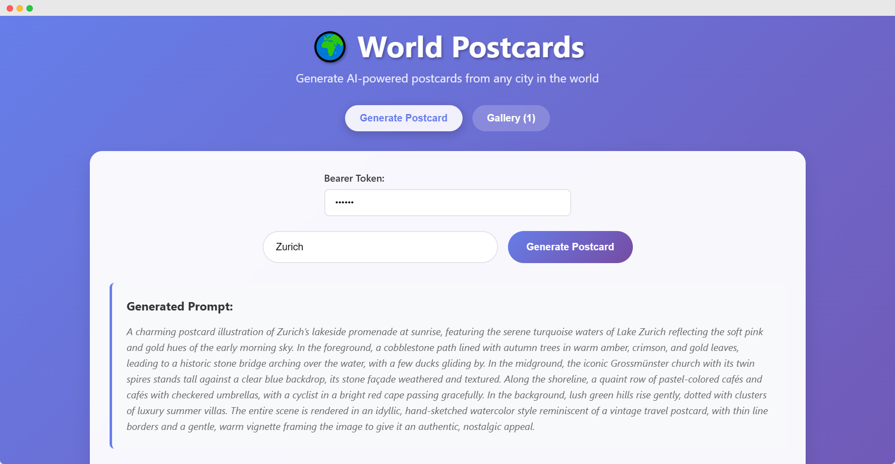

# 🌍 AI Postcard Generator

A full-stack AI-powered application that generates beautiful postcard images from city names using Cloudflare's edge computing platform. Built with React, TypeScript, and Cloudflare Workers.



## 🚀 Improvements from Original Workshop

This project extends the original workshop with the following enhancements:

- **🗑️ Delete Functionality** - Remove unwanted postcards with hover-to-reveal delete buttons
- **📥 Download Functionality** - Save postcards to device with one-click download
- **💾 Save/Regenerate Flow** - Preview postcards before saving, regenerate until satisfied
- **🔧 TypeScript Improvements** - Removed all `@ts-expect-error` comments with proper type definitions

## ✨ Features

- **AI-Powered Prompt Generation**: Uses Cloudflare AI to create detailed image prompts from city names
- **Image Generation**: Leverages Leonardo AI model to create stunning postcard-style images
- **Preview & Save Flow**: Generate temporary postcards, regenerate until satisfied, then save to gallery
- **Gallery Management**: Browse, download, and delete postcards with hover-to-reveal buttons
- **Smart Generation**: Only saves postcards to database when explicitly saved by user
- **Responsive Design**: Beautiful, modern UI that works on all devices
- **Edge Computing**: Fast global performance using Cloudflare Workers
- **Persistent Storage**: Images stored in Cloudflare R2, metadata in D1 database

## 🛠️ Tech Stack

- **Frontend**: React 19, TypeScript, CSS3
- **Backend**: Cloudflare Workers, Hono framework
- **AI Models**:
  - `@cf/openai/gpt-oss-20b` for prompt generation
  - `@cf/leonardo/lucid-origin` for image generation
- **Database**: Cloudflare D1 (SQLite)
- **Storage**: Cloudflare R2 (Object Storage)
- **Build Tools**: Vite, TypeScript
- **Testing**: Vitest

## 🚀 Quick Start

### Prerequisites

- Node.js 18+
- Cloudflare account
- Wrangler CLI installed globally

### Installation

1. Clone the repository:

```bash
git clone https://github.com/JKrokos/ai-postcard-generator.git
cd ai-postcard-generator
```

2. Install dependencies:

```bash
npm install
```

3. Configure Cloudflare resources:

   - Update `wrangler.jsonc` with your actual database ID and bucket name
   - Create D1 database: `npx wrangler d1 create your-database-name`
   - Create R2 bucket: `npx wrangler r2 bucket create your-bucket-name`
   - Configure bearer token:
     - **For development**: Copy `.dev.vars.example` to `.dev.vars` and replace with your actual bearer token
     - **For production**: Run `npx wrangler secret put BEARER_TOKEN` and paste your token when prompted

4. Deploy database schema:

```bash
npx wrangler d1 execute your-database-name --file=./db/schema.sql
```

5. Deploy the application:

```bash
npm run deploy
```

### Development

Start the development server:

```bash
npm run dev
```

The application will be available at `http://localhost:5173`

### Deployment

Deploy to Cloudflare:

```bash
npm run deploy
```

## 🎯 Usage

1. **Enter Bearer Token**: Input your secure bearer token for API access
2. **Enter City Name**: Type any city name (e.g., "Paris", "Tokyo", "New York")
3. **Generate**: Click "Generate Postcard" to create your AI-powered postcard
4. **View Gallery**: Browse all generated postcards in the gallery tab

## 📁 Project Structure

```
├── src/                    # React frontend source
│   ├── App.tsx            # Main application component
│   ├── App.css            # Styling and responsive design
│   └── main.tsx           # Application entry point
├── worker/                 # Cloudflare Worker backend
│   └── index.ts           # API routes and AI integration
├── db/                     # Database schema
│   └── schema.sql         # D1 database table definitions
├── public/                 # Static assets
├── dist/                   # Build output
├── wrangler.jsonc         # Cloudflare Worker configuration
├── vite.config.ts         # Vite build configuration
└── package.json           # Dependencies and scripts
```

## 🔧 API Endpoints

- `POST /api/generate/prompt` - Generate AI prompt from city name (no DB save)
- `POST /api/generate/temp-image` - Generate temporary image for preview
- `POST /api/save/postcard` - Save postcard to database and R2 storage
- `GET /api/image/:id` - Retrieve saved image from R2
- `GET /api/gallery` - Get all saved postcards
- `DELETE /api/postcard/:id` - Delete postcard and associated image

## 🎨 Customization

The application uses a modern gradient design with glassmorphism effects. You can customize:

- **Colors**: Update CSS variables in `App.css`
- **AI Models**: Modify model names in `worker/index.ts`
- **Prompt Engineering**: Adjust the prompt instructions for different styles
- **Image Dimensions**: Configure image generation parameters

## 🔒 Security

- Bearer token authentication for API access
- Input validation and sanitization
- CORS headers configured
- Environment variables for sensitive data

### Bearer Token Configuration

The application requires a bearer token for API authentication. This token should be:
- A secure, randomly generated string (e.g., using `openssl rand -hex 32`)
- The same token used by clients to authenticate API requests
- Kept secret and never committed to version control

## ⚠️ Security Notice

**This application is currently configured for development/demo purposes.** Before deploying to production:

1. **Implement rate limiting** to prevent API abuse
2. **Add user authentication** or implement demo mode with daily limits
3. **Monitor usage** to prevent unexpected costs from AI model usage
4. **Consider read-only mode** for public demos

## 📝 License

This project is open source and available under the [MIT License](LICENSE).

## 🙏 Credits

This project is based on the excellent workshop **"Building a Full-Stack AI Application on the Edge"** by [Harshil Agrawal](https://github.com/harshil1712). The original workshop repository can be found at: https://github.com/harshil1712/full-stack-ai-app-workshop

Special thanks to Harshil for creating such an informative and well-structured workshop that demonstrates the power of Cloudflare's AI and edge computing capabilities.

## 🤝 Contributing

Contributions are welcome! Please feel free to submit a Pull Request.

## 📞 Support

If you have any questions or issues, please open an issue on GitHub.
